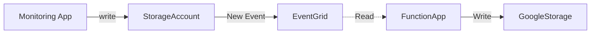

# Copy Azure Storage Google Cloud

This project demonstrates how to copy files between Azure and Google Cloud.

## Architecture Diagram


## DevOps Architecture Diagram


## Simplified Flow Diagram



## Components

### Solution

- [Azure Blob Storage](https://azure.microsoft.com/en-us/products/storage/blobs/) - Target storage account where monitoring applications saves new files.
- [Azure Event Grid](https://azure.microsoft.com/en-us/products/event-grid/) - Capture Storage Events.
- [Azure Function App](https://azure.microsoft.com/en-us/products/functions/) - Event-driven, serverless compute to copy file to Google Cloud Storage.
- [Google Cloud Storage](https://cloud.google.com/storage/) - Target store to save file.

### DevOps

- [Azure CLI](https://learn.microsoft.com/cli/azure/install-azure-cli) - Provisioning, managing and deploying the application to Azure.
- [GitHub Actions](https://github.com/features/actions) - The CI/CD pipelines.
- [Azure Developer CLI](https://learn.microsoft.com/azure/developer/azure-developer-cli/overview) - The CI/CD pipelines.

### Developer tools

- [Visual Studio Code](https://code.visualstudio.com/) - The local IDE experience.
- [GitHub Codespaces](https://github.com/features/codespaces) - The cloud IDE experience.

# Deploy Resources

This project uses scripts to provision infrastructure, package, and deploy the application to Azure and Google Cloud.

## Prerequisites

- Azure Subscription
- [Google Cloud Project](docs/setting_up_gcp.md)
- GitHub Account
- Azure CLI
- Google Cloud CLI

**Install Azure CLI**

```bash
# Check if installed
az --version

# Install azure cli
curl -sL https://aka.ms/InstallAzureCLIDeb | sudo bash

az --version
```

## Create System Identities

The solution uses several system identities.

| System Identities                 | Authentication                                             | Authorization                                                                                                                                                                  | Purpose                                                                             |
| --------------------------------- | ---------------------------------------------------------- | ------------------------------------------------------------------------------------------------------------------------------------------------------------------------------ | ----------------------------------------------------------------------------------- |
| `env.AZURE_CICD_CLIENT_NAME`      | OpenId Connect (OIDC) based Federated Identity Credentials | Subscription Contributor access<br>Microsoft Graph API admin consent Permissions: <ul><li>Directory.ReadWrite.All</li><li>User.Invite.All</li><li>User.ReadWrite.All</li></ul> | Deploy cloud resources: <ul><li>core infrastructure</li><li>function app</li></ul>  |
| `env.GOOGLE_CICD_SERVICE_ACCOUNT` | OpenId Connect (OIDC) based Federated Identity Credentials | <ul><li>roles/storage.admin</li><li>roles/serviceusage.serviceUsageAdmin</li><li>roles/iam.serviceAccountCreator</li></ul>                                                     | Deploy cloud resources: <ul><li>core infrastructure</li><li>cloud storage</li></ul> |
| `env.AZURE_APP_SERVICE_CLIENT`    | Workload identity federation or JSON key file              | <ul><li>Storage Blob Data Reader on Storage Account</li></ul>                                                                                                                  | Read Blob Contents to copy                                                          |

```bash
# load .env vars (optional)
[ ! -f .env ] || eval "export $(grep -v '^#' .env | xargs)"
# or this version allows variable substitution and quoted long values
[ -f .env ] && while IFS= read -r line; do [[ $line =~ ^[^#]*= ]] && eval "export $line"; done < .env

# Login to cloud cli. Only required once per install.
az login --tenant $AZURE_TENANT_ID
gcloud auth login --quiet

# Create Azure CICD system identity
./scripts/create_cicd_sp.sh --cloud azure
./scripts/create_app_sp.sh --cloud azure --name "$APP_NAME" --env "$ENV_NAME"

# Set IAM project as default
gcloud config set project "$GOOGLE_IAM_PROJECT_ID"
# Create Google CICD system identity and configure workload identity federation with GitHub Actions
./scripts/create_cicd_sp.sh --cloud google
```

## Provisioning

Running the following commands will provision cloud resources for deploying the application.

```bash
# Configure the environment variables. Copy `example.env` to `.env` and update the values
cp example.env .env
# load .env vars
[ ! -f .env ] || export $(grep -v '^#' .env | xargs)
# or this version allows variable substitution and quoted long values
[ -f .env ] && while IFS= read -r line; do [[ $line =~ ^[^#]*= ]] && eval "export $line"; done < .env

# Login to az. Only required once per install.
az login --tenant $AZURE_TENANT_ID

# Provision infrastructure and the development environment
./scripts/devops.sh provision --name "$APP_NAME" --environment "$ENV"

# Login to gcloud. Only required once per install.
gcloud auth activate-service-account "${GOOGLE_CICD_SERVICE_ACCOUNT}" --key-file="${GOOGLE_CICD_CLIENT_KEY_FILE}"
gcloud auth list
./scripts/gcp_provision.sh --project "$GOOGLE_PROJECT_ID" --environment "$ENV"

# Add permissions to the function app service account
./scripts/az_permissions.sh --name "$APP_NAME" --environment "$ENV"
```

## Deployment

```bash
# load .env vars
[ ! -f .env ] || export $(grep -v '^#' .env | xargs)
# or this version allows variable substitution and quoted long values
[ -f .env ] && while IFS= read -r line; do [[ $line =~ ^[^#]*= ]] && eval "export $line"; done < .env

# Package the app using the environment variables in .azure/env + deploy the code on Azure
./scripts/devops.sh deploy --name "$APP_NAME" --environment "$ENV_NAME"

# Create event subscription
./scripts/devops.sh event --name "$APP_NAME" --environment "$ENV_NAME"
```

# Development

You'll need to set up a development environment if you want to develop a new feature or fix issues.

The project uses a docker based devcontainer to ensure a consistent development environment.

- Open the project in VSCode and it will prompt you to open the project in a devcontainer. This will have all the required tools installed and configured.

## Setup local dev environment

If you want to develop outside of a docker devcontainer you can use the following commands to setup your environment.

- Install Python
- Install Node
- Install Azure CLI
- Install Azure Functions Core Tools
- Install Google Cloud CLI
- Install Bicep
- Configure linting and formatting tools

```bash
# Configure the environment variables. Copy `example.env` to `.env` and update the values
cp example.env .env

# load .env vars
[ ! -f .env ] || export $(grep -v '^#' .env | xargs)
# or this version allows variable substitution and quoted long values
[ -f .env ] && while IFS= read -r line; do [[ $line =~ ^[^#]*= ]] && eval "export $line"; done < .env

# Create and activate a python virtual environment
python3 -m venv ./functions/.venv
source ./functions/.venv/bin/activate

# Install python requirements
pip install -r ./functions/requirements_dev.txt

# Install Node
curl -o- https://raw.githubusercontent.com/nvm-sh/nvm/v0.39.3/install.sh | bash
source /root/.bashrc && nvm install v18.17.0 && npm init -y

# Configure Azure CLI and authenticate
az --version
curl -sL https://aka.ms/InstallAzureCLIDeb | sudo bash
# login to azure cli
az login --tenant $TENANT_ID

# Install Azure Functions Core Tools
./install_az_func_core_tools.sh

# Install Google Cloud CLI
echo "deb [signed-by=/usr/share/keyrings/cloud.google.gpg] http://packages.cloud.google.com/apt cloud-sdk main" | tee -a /etc/apt/sources.list.d/google-cloud-sdk.list && curl https://packages.cloud.google.com/apt/doc/apt-key.gpg | apt-key --keyring /usr/share/keyrings/cloud.google.gpg  add - && apt-get update -y && apt-get install google-cloud-cli -y

# Install bicep
az bicep install

# Configure linting and formatting tools
sudo apt-get update
sudo apt-get install -y shellcheck
pre-commit install

# Npm install
npm install
```

## Tasks

The devcontainer comes with some useful tasks to help you with development, you can start these tasks by opening the command palette with `Shift`+`Command`+`P`(Mac) / `Ctrl`+`Shift`+`P` (Windows/Linux) and select `Tasks: Run Task` then select the task you want to run.

- `Run Function App` - Run the function app locally.
- `Install Requirements` - Install python dependencies to function folder.

If you want to run these tasks outside of the devcontainer you can use the following commands.

```bash
# Run function app. This assumes you have already provisioned and setup the system identities.
# Copy .env values to local.settings.json
./scripts/copy_env.sh
cd ./functions
func host start
```

## Style Guidelines

This project enforces quite strict [PEP8](https://www.python.org/dev/peps/pep-0008/) and [PEP257 (Docstring Conventions)](https://www.python.org/dev/peps/pep-0257/) compliance on all code submitted.

We use [Black](https://github.com/psf/black) for uncompromising code formatting.

Summary of the most relevant points:

- Comments should be full sentences and end with a period.
- [Imports](https://www.python.org/dev/peps/pep-0008/#imports) should be ordered.
- Constants and the content of lists and dictionaries should be in alphabetical order.
- It is advisable to adjust IDE or editor settings to match those requirements.

### Use new style string formatting

Prefer [f-strings](https://docs.python.org/3/reference/lexical_analysis.html#f-strings) over `%` or `str.format`.

```python
#New
f"{some_value} {some_other_value}"
# Old, wrong
"{} {}".format("New", "style")
"%s %s" % ("Old", "style")
```

One exception is for logging which uses the percentage formatting. This is to avoid formatting the log message when it is suppressed.

```python
_LOGGER.info("Can't connect to the web service %s at %s", string1, string2)
```

## Testing

Ideally, all code is checked to verify the following:

- All the unit tests pass
- All code passes the checks from the linting tools

To run the linters, run the following commands:

```bash
# Use pre-commit scripts to run all linting
pre-commit run --all-files

# Run a specific linter via pre-commit
pre-commit run --all-files codespell

# Run linters outside of pre-commit
isort .
codespell .
black .
flake8 .
bandit -c pyproject.toml -r .
pydocstyle .
npx prettier . --check
shellcheck -x ./script/*.sh
pylint --ignore-paths="^functions/.venv/.*$" ./functions/

# Check for window line endings
find **/ -not -type d -exec file "{}" ";" | grep CRLF
# Fix with any issues with:
# sed -i.bak 's/\r$//' ./path/to/file
# Or Remove them
# find . -name "*.Identifier" -exec rm "{}" \;

# Optionally use Node to run all linters
npm run lint
```

# Architecture Design Decisions

## Blob Storage trigger vs Event Grid trigger

If you're using earlier versions of the Blob Storage trigger with Azure Functions, you often get delayed executions because the trigger polls the blob container for updates. You can reduce latency by triggering your function using an event subscription to the same container. The event subscription forwards changes in the container as events that your function consumes by using Event Grid. You can implement this capability with Visual Studio Code with latest Azure Functions extension.

## Google CICD Authentication

Google's auth github actions recommends:

> use Direct Workload Identity Federation instead of exporting a long-lived Service Account Key JSON credential as this poses a security risk.

# References

- Event Grid Trigger https://learn.microsoft.com/en-us/azure/azure-functions/functions-event-grid-blob-trigger?pivots=programming-language-javascript
- Setup Google Workload Identity Federation https://github.com/google-github-actions/auth#setup
- Google Workload Identity Federation with GitHub Actions https://cloud.google.com/iam/docs/workload-identity-federation-with-deployment-pipelines
- GitHub OIDC token attributes https://docs.github.com/en/actions/deployment/security-hardening-your-deployments/about-security-hardening-with-openid-connect#understanding-the-oidc-token
- Google How to Authenticate Service Accounts https://cloud.google.com/blog/products/identity-security/how-to-authenticate-service-accounts-to-help-keep-applications-secure
- Python Confidential Client Example https://github.com/AzureAD/microsoft-authentication-library-for-python/blob/dev/sample/confidential_client_secret_sample.py
