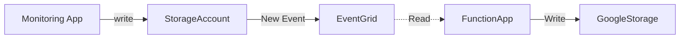

# Copy Azure Storage Google Cloud

This project demonstrates how to copy files between Azure and Google Cloud.

## Architecture Diagram


## DevOps Architecture Diagram


## Simplified Flow Diagram



## Components

### Solution

- [Azure Blob Storage](https://azure.microsoft.com/en-us/products/storage/blobs/) - Target storage account where monitoring applications saves new files.
- [Azure Event Grid](https://azure.microsoft.com/en-us/products/event-grid/) - Capture Storage Events.
- [Azure Function App](https://azure.microsoft.com/en-us/products/functions/) - Event-driven, serverless compute to copy file to Google Cloud Storage.
- [Google Cloud Storage](https://cloud.google.com/storage/) - Target store to save file.

### DevOps

- [Azure CLI](https://learn.microsoft.com/cli/azure/install-azure-cli) - Provisioning, managing and deploying the application to Azure.
- [GitHub Actions](https://github.com/features/actions) - The CI/CD pipelines.
- [Azure Developer CLI](https://learn.microsoft.com/azure/developer/azure-developer-cli/overview) - The CI/CD pipelines.

### Developer tools

- [Visual Studio Code](https://code.visualstudio.com/) - The local IDE experience.
- [GitHub Codespaces](https://github.com/features/codespaces) - The cloud IDE experience.

# Development Environment

1. Fork this repository.
2. Create a new GitHub Codespaces from your fork. This will automatically provision a new Codespaces with all the required dependencies preinstalled and configured.
3. Open a new terminal and run `npm install && npm run prepare`

# Deploy Resources

This project uses scripts to provision infrastructure, package, and deploy the application to Azure and Google Cloud.

## Prerequisites

- Azure Subscription
- Google Cloud Account
- GitHub Account

## Provisioning

Running the following commands will provision cloud resources for deploying the application.

```bash
# Configure the environment variables. Copy `example.env` to `.env` and update the values
cp example.env .env
# load .env vars
[ ! -f .env ] || export $(grep -v '^#' .env | xargs)

# Login to az. Only required once per install.
az login --tenant $AZURE_TENANT_ID

# Provision infrastructure and the azd development environment
./scripts/devops.sh provision --name "$APP_NAME" --environment "$AZURE_ENV_NAME"
```

## Deployment

```bash
# Package the app using the environment variables in .azure/env + deploy the code on Azure
./scripts/devops.sh deploy --name "$APP_NAME" --environment "$AZURE_ENV_NAME"

# Create event subscription
./scripts/devops.sh event-subscription --name "$APP_NAME" --environment "$AZURE_ENV_NAME"
```

# Architecture Design Decisions

## Blob Storage trigger vs Event Grid trigger

If you're using earlier versions of the Blob Storage trigger with Azure Functions, you often get delayed executions because the trigger polls the blob container for updates. You can reduce latency by triggering your function using an event subscription to the same container. The event subscription forwards changes in the container as events that your function consumes by using Event Grid. You can implement this capability with Visual Studio Code with latest Azure Functions extension.

# References

- Event Grid Trigger https://learn.microsoft.com/en-us/azure/azure-functions/functions-event-grid-blob-trigger?pivots=programming-language-javascript
